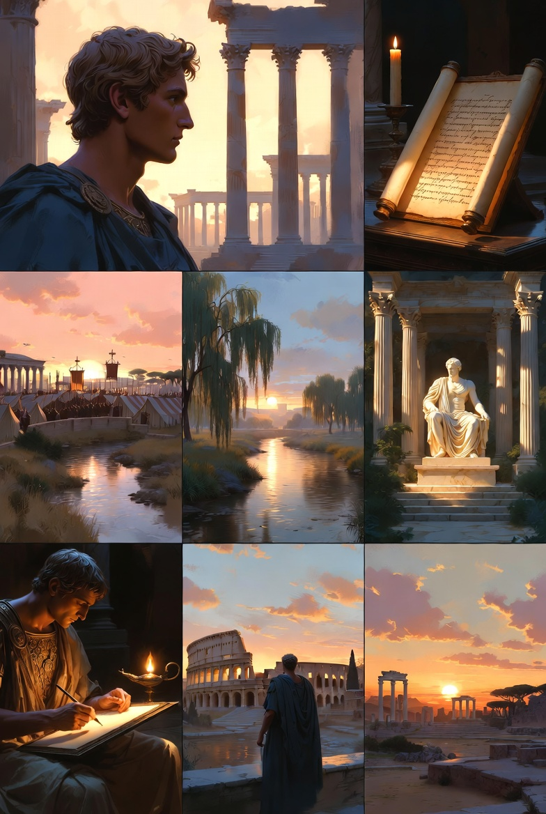

# CONTENUTI SOCIAL - ON THE RELAX

---

## MEDITATIONS - 1

"When you arise in the morning, think of what a precious privilege it is to be alive, to breathe, to think, to enjoy, to love."

Marcus Aurelius wrote these words as personal reflections. Never meant to be read by anyone else. Just a man trying to stay human while the weight of an empire pressed down on him.

*From "Meditations" - available for free during launch at onde.la*

---

## MEDITATIONS - 2

"You have power over your mind - not outside events. Realize this, and you will find strength."

In volatile times, this 2,000-year-old insight from Marcus Aurelius is more relevant than ever. The difference between thriving and struggling often comes down to mindset.

*From "Meditations" - available for free during launch at onde.la*

---

## MEDITATIONS - 3 (Thread 1/2)

Marcus Aurelius wrote "Meditations" as a personal journal. Never intended for publication. Never meant to be a guide for CEOs, entrepreneurs, and leaders across millennia.

*Thread continues...*

---

## MEDITATIONS - 3 (Thread 2/2)

Yet here we are. His morning reflections on life, death, and duty have become one of history's most influential leadership texts.

Some wisdom transcends time because it speaks to eternal human challenges.

*From "Meditations" - available for free during launch at onde.la*

---

## MEDITATIONS - 4

"You have power over your mind - not outside events."

In volatile markets and uncertain times, this 2,000-year-old insight from Marcus Aurelius is more relevant than ever.

The difference between thriving organizations and struggling ones often comes down to mindset: focusing on what we can control versus what we cannot.

Our Classics Collection brings these timeless strategies to today's leaders.

*From "Meditations" - available for free during launch at onde.la*

---

## MEDITATIONS - 5

"Very little is needed to make a happy life; it is all within yourself, in your way of thinking."

As we build companies and careers, Marcus Aurelius reminds us that success isn't about accumulation—it's about perspective.

Our mission at ONDE is to make wisdom accessible, beautiful, and practical for modern readers.

*From "Meditations" - available for free during launch at onde.la*

---

## MEDITATIONS - 6

"You have power over your mind - not outside events." 💭

Inner strength beats outer chaos every time.

Marcus Aurelius wisdom from "Meditations" - link in bio.

*From "Meditations" - available for free during launch at onde.la*

---

## MEDITATIONS - 7

Marcus Aurelius was the most powerful man in the world. Yet every morning, he reminded himself: "When you arise in the morning, think of what a precious privilege it is to be alive, to breathe, to think, to enjoy, to love."

If the Roman Emperor needed this reminder, how much more do we?

Our new edition of "Meditations" makes these timeless reflections accessible and beautiful for today's readers.

*From "Meditations" - available for free during launch at onde.la*

---

## MEDITATIONS - 8

"The impediment to action advances action. What stands in the way becomes the way."

This powerful insight from Marcus Aurelius has helped leaders overcome challenges for 2,000 years. Every obstacle contains the opportunity for growth.

Our Classics Collection presents wisdom not as museum pieces, but as practical tools for modern life.

What challenge are you facing right now?

*From "Meditations" - available for free during launch at onde.la*

---

## MEDITATIONS - 9

"You have power over your mind - not outside events. Realize this, and you will find strength."

In uncertain times, Marcus Aurelius offers this timeless truth: focus on what you can control. Your mindset, your response, your choices.

We've created a beautiful edition of "Meditations" that brings ancient wisdom to modern challenges.

*From "Meditations" - available for free during launch at onde.la*

---

## MEDITATIONS - 10

"Very little is needed to make a happy life; it is all within yourself, in your way of thinking."

Marcus Aurelius reminds us that happiness isn't about what we have—it's about how we think. A message that matters more than ever in our consumer culture.

Our mission is to make wisdom accessible, beautiful, and practical.

What makes you truly happy?

*From "Meditations" - available for free during launch at onde.la*

---

## PSALM 23 - 1

The Lord is my shepherd; I shall not want. He makes me lie down in green pastures.

*From "Psalm 23" - Ancient wisdom, timeless peace. Available for free during launch at onde.la*

---

## PSALM 23 - 2

In an era of constant distraction, ancient wisdom offers something remarkable: clarity.

Psalm 23's "The Lord is my shepherd" isn't just poetry—it's a framework for leadership that has guided minds for 3,000 years.

We're bringing this timeless perspective to modern readers through our Classics Collection. Because some truths don't age.

*From "Psalm 23" - available for free during launch at onde.la*

---

*@ONDE_FRH - Where Stories Flow...*
